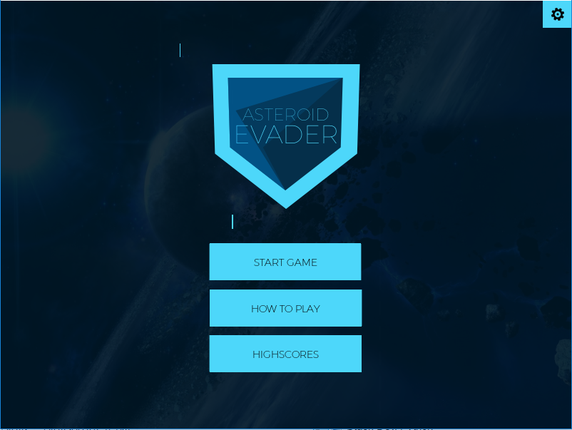
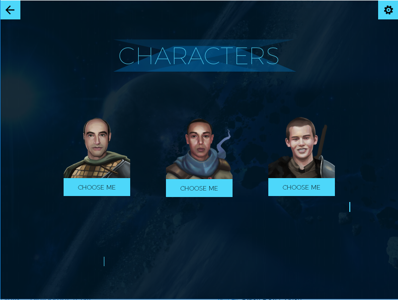
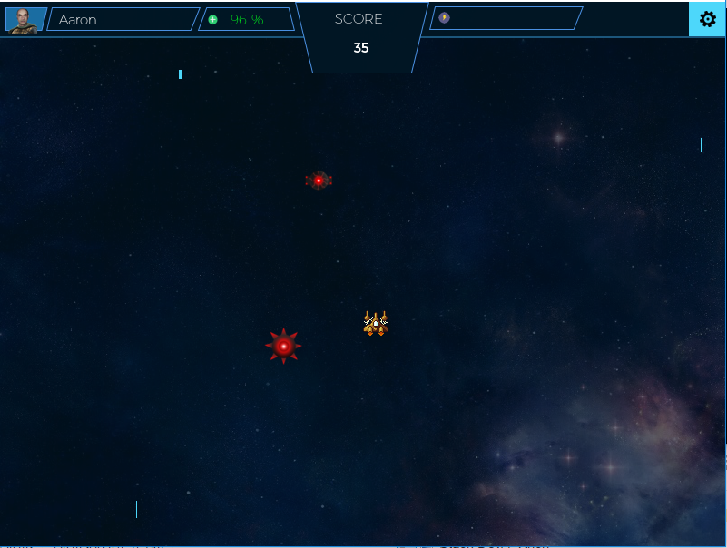

# Asteroid Evader
Asteroid Evader is a 2D space survival/adventure game created with Pygame. The aim of this game is to survive for as long as possible, you will ecounter obstacles such as Asteroids, Mines and Bombs. There are also perks available to help you in your journey. I created this game to experiment with pygame so initially I made it fairly simple however in the future I'm looking to expand this into a fully fledged 2D adventure game.








### Getting Started
These instructions will get you a copy of the project up and running on your local machine.
Firstly click here to download the game [Download](https://github.com/AaronKazah/Asteroid-Evader/archive/v1.0.zip)


#### Prerequisities
Here are the things you need to run the game. The latest version of python and the latest version of pygame. You can get the latest version of Python from [Python](https://www.python.org/)

You can get the latest version of pygame from [Pygame](http://www.pygame.org/download.shtml). If you can't find the latest version of pygame for your python verision or if it's outdated then go to http://www.lfd.uci.edu/~gohlke/pythonlibs/#pygame and download the appropriate wheel file for your PYTHON VERSION and WINDOWS VERSION

You then install the wheel package from ```pip ``` then install Pygame (this verision here is for Python 3.4 and Windows 64x)
```sh
pip install wheel
pip install pygame‑1.9.2a0‑cp34‑none‑win_amd64.whl
```
If you don't have pip, you can watch this video showing you how to get it on [Youtube](https://www.youtube.com/watch?v=zPMr0lEMqpo)


#### Running
Once you have everything ready to run pygame, simply open the the zip file and double click the "main.py" file. You should be presented with this screen


#### Built With
- Python
- Pygame
- Sketch for designs and assets

### Version
1.0

### License
This project is licensed under the DBAD License - see the [LICENSE.md](http://www.dbad-license.org/) file for details

### Acknowldgements
The assets here were offered for free by numerous graphic artist and I'd like to thank them for offering their work for free. Also the music producers too.
- Okay, I will update this in the future

